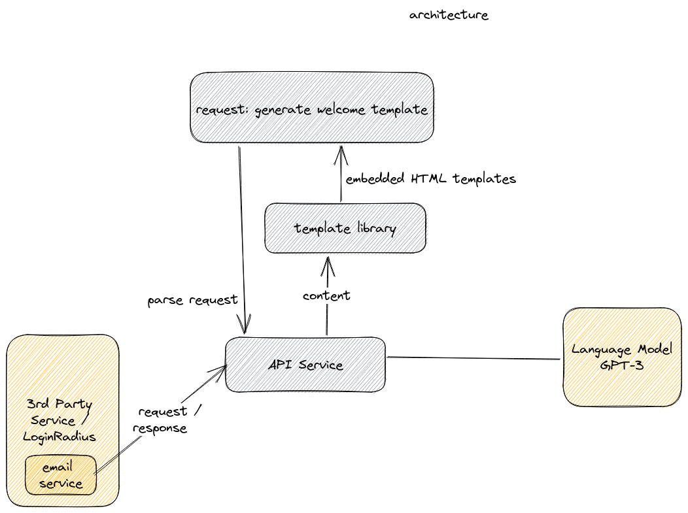

# lr-hackathon-sendright

SendRight - the ultimate transactional email content generate application, generate professional sounding emails based on your keywords powered by OpenAI GPT-3!

### Architecture

### Run the app

1. Set up your environment, Sign up for an [OpenAI](https://platform.openai.com/signup) account and put your private key in env OpenAISecret={OPENAI_SECRET}
2. Run the application, local dev environment `go run main.go`. 

### Usecases

- Time saved writing medium-long sized emails.
- Professional sounding transactional emails.
- Quick email template starter, allows you quickly start with your personalized email template.

### Contribute
We appreciate all kinds of contributions from anyone, be it finding an issue or adding a feature.

Please check the [contributing guide](CONTRIBUTING.md) to become a contributor.

### License
For more information on licensing, please refer to [License](LICENSE)
